# 001 Goals _ what you will learn by the end of this section
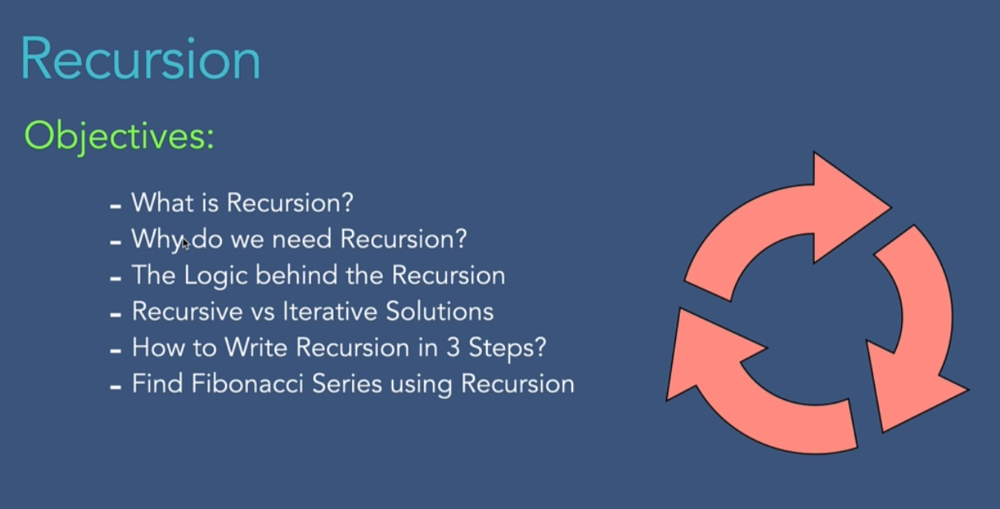

# 002 What is Recursion_
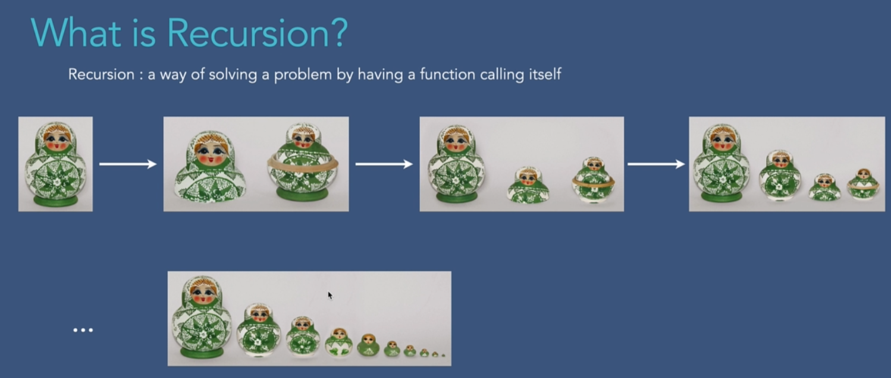

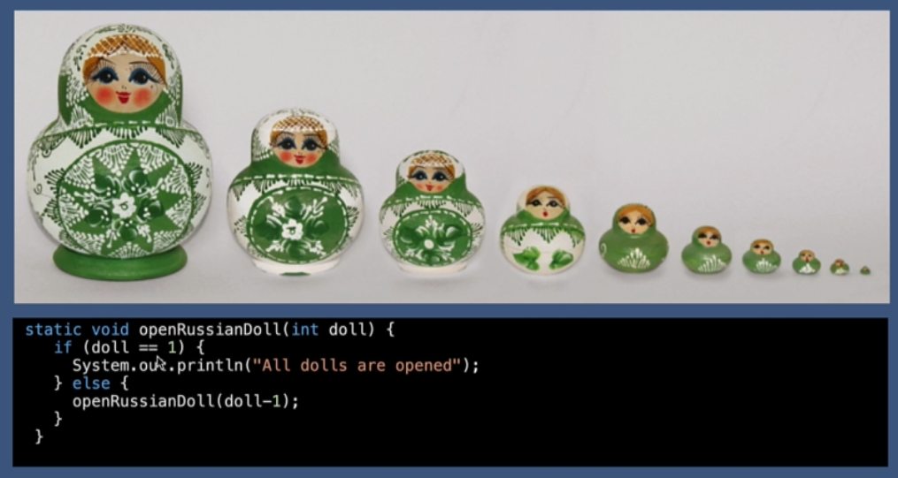

# 003 Why do we need Recursion_
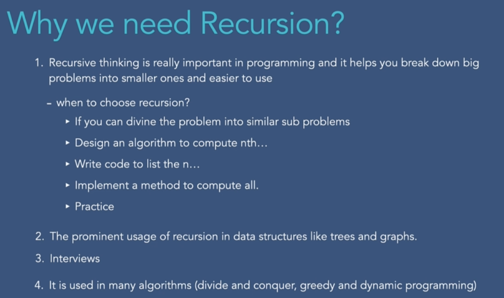

# 004 The Logic Behind Recursion
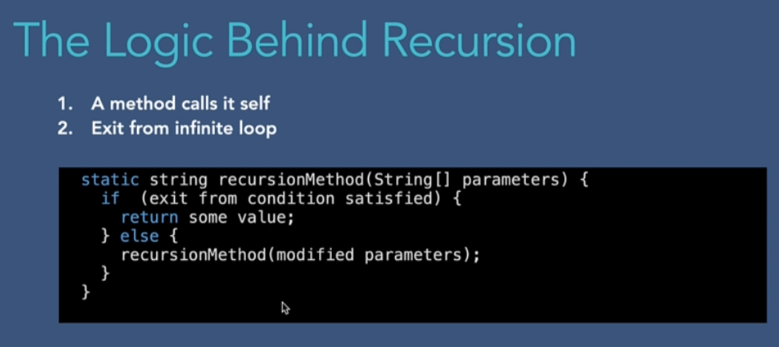

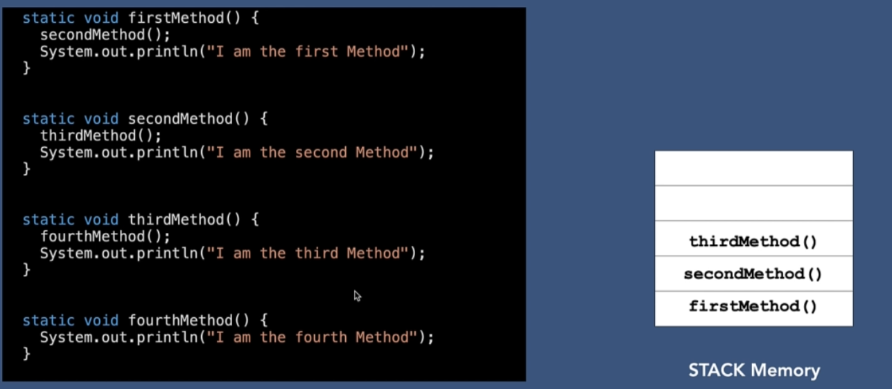
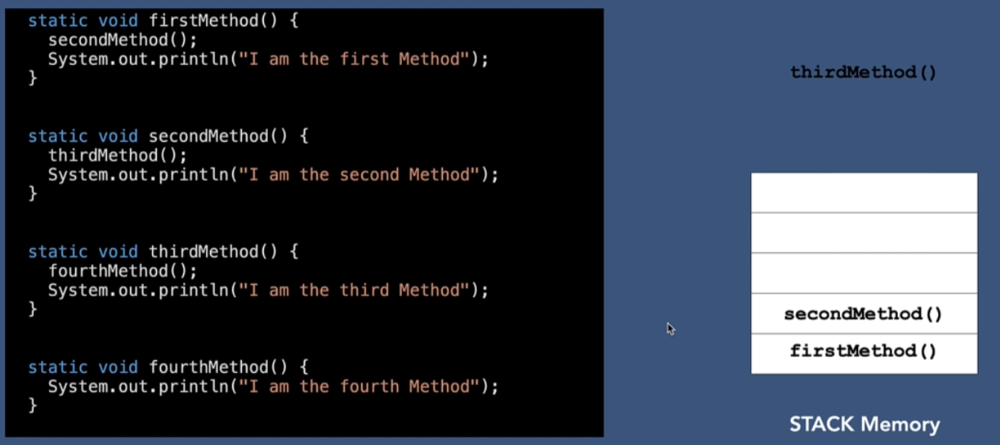
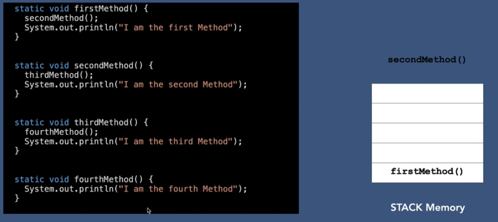
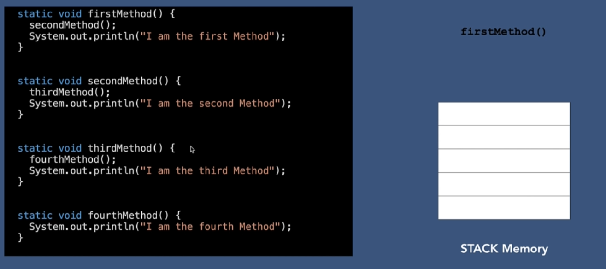
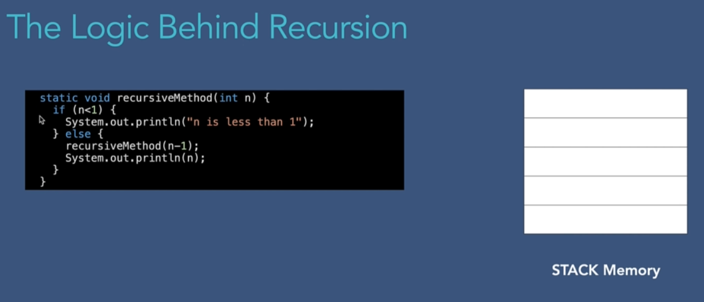
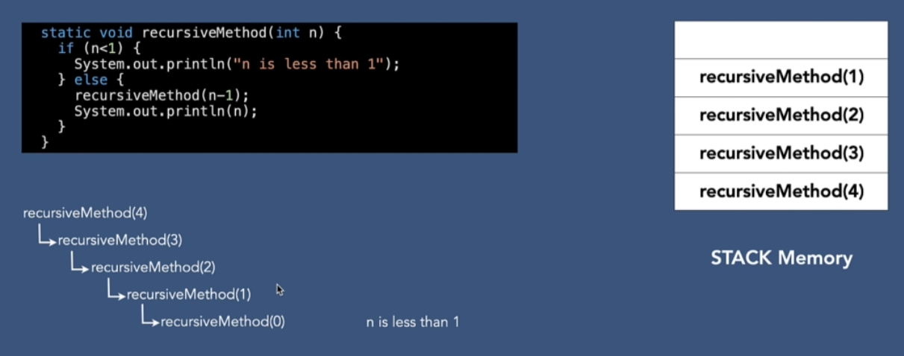
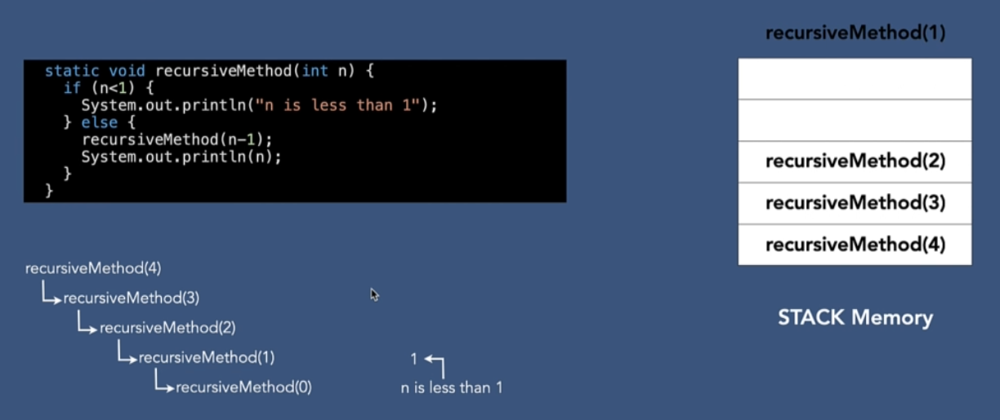
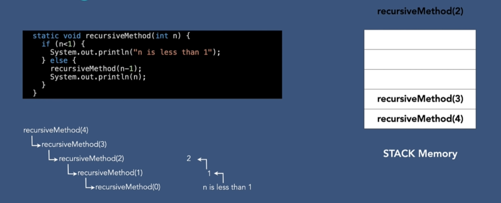
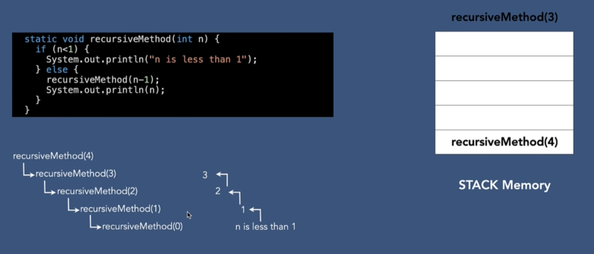
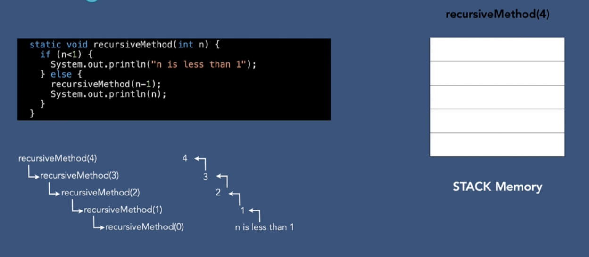

# 005 Recursive vs Iterative Solution
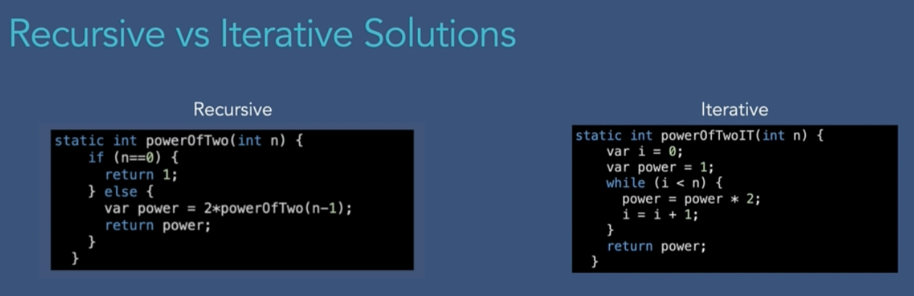
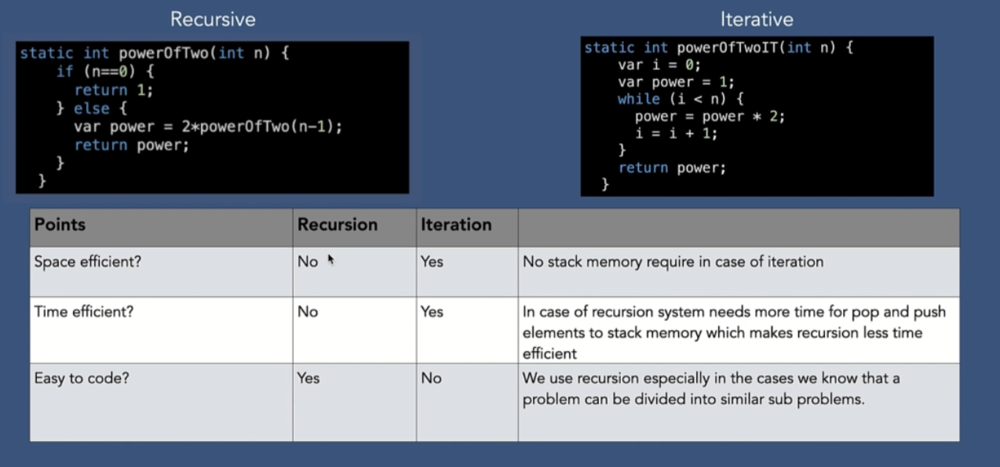