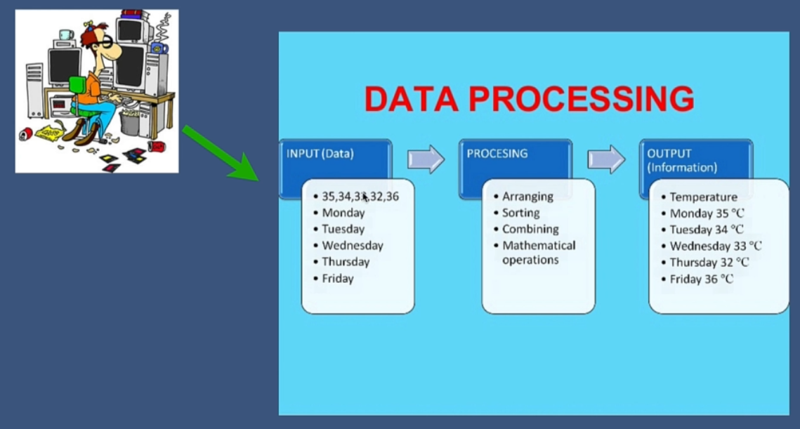
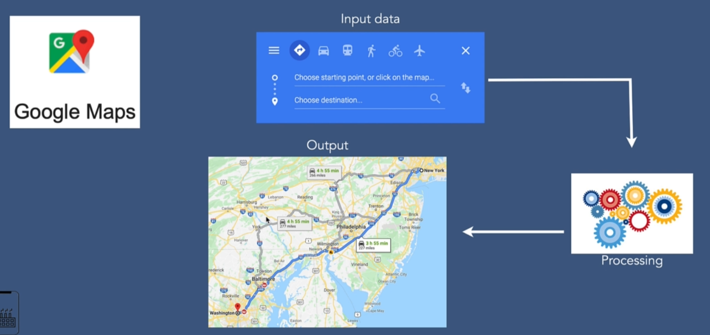
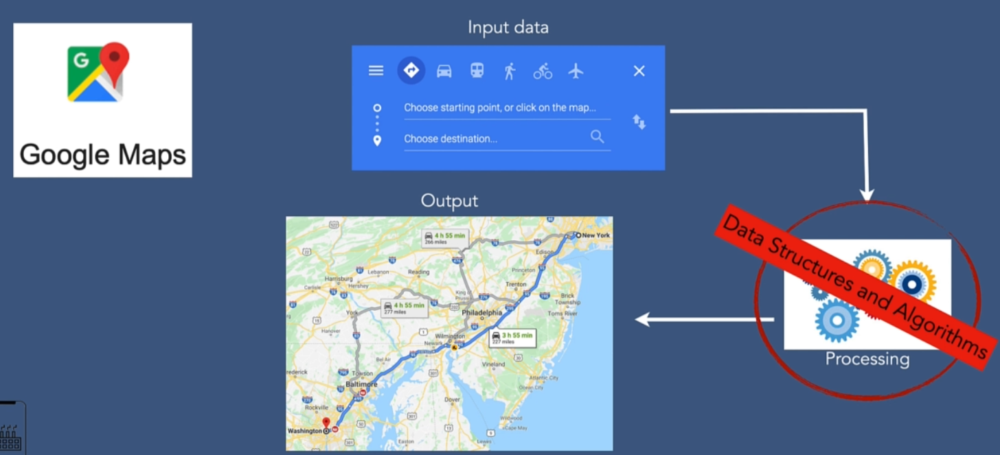
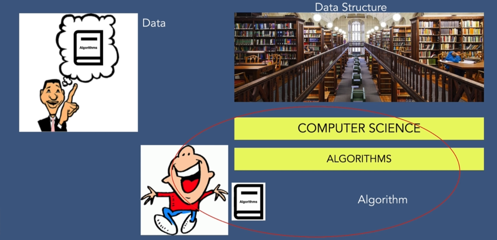
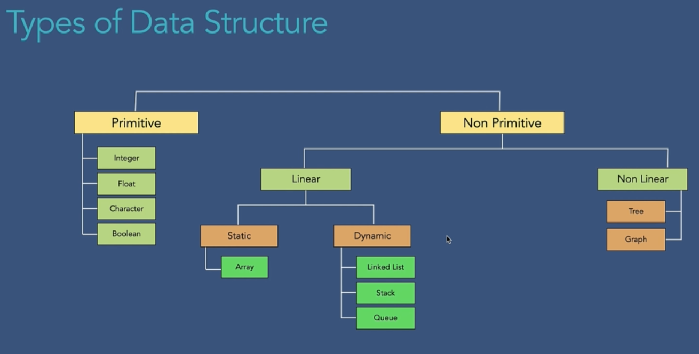
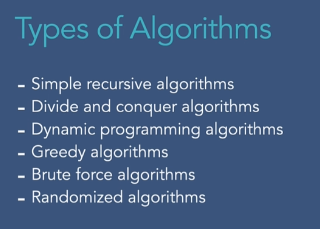
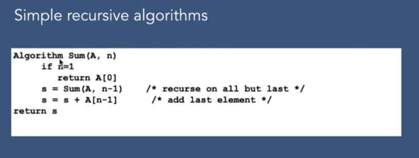
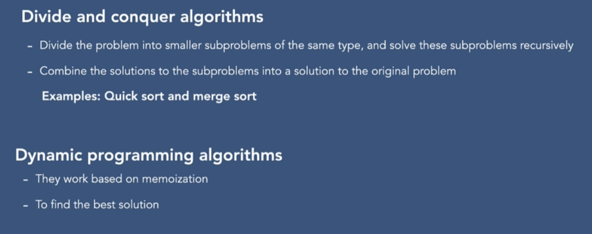
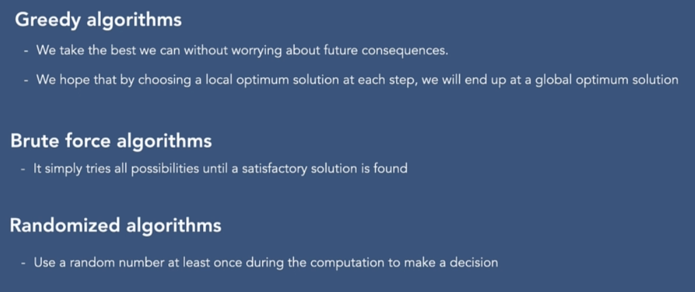

# 002. What is data structure ?

- Queue DS 
- Stack DS 

# 003 What is an Algorithm ?

# 004 Why are Data Structures and Algorithms important ?

# 005 Types of Data Structures

# 006 Types of Algorithms

