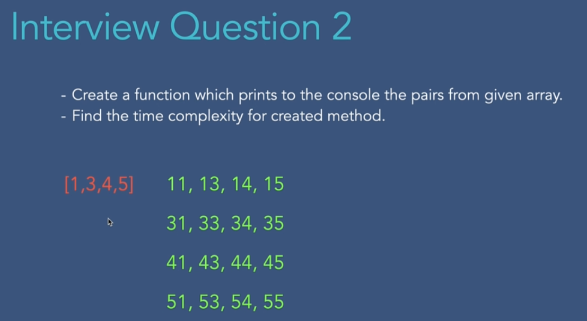
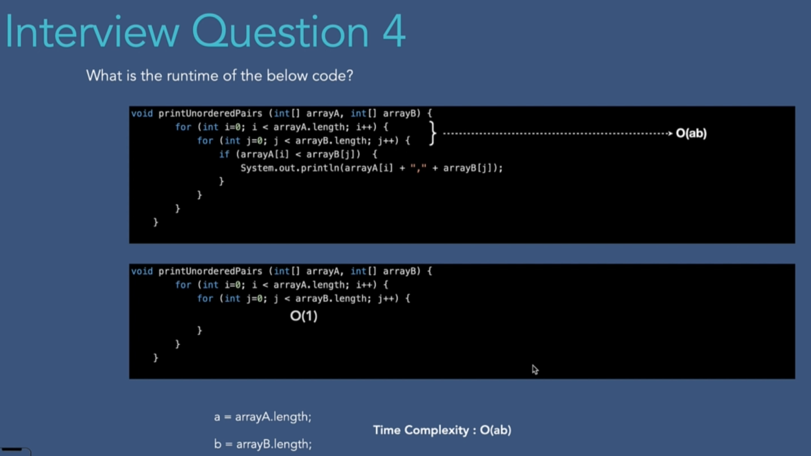
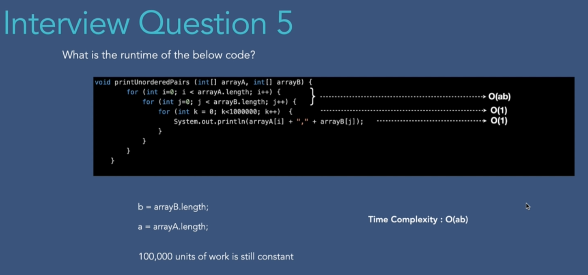
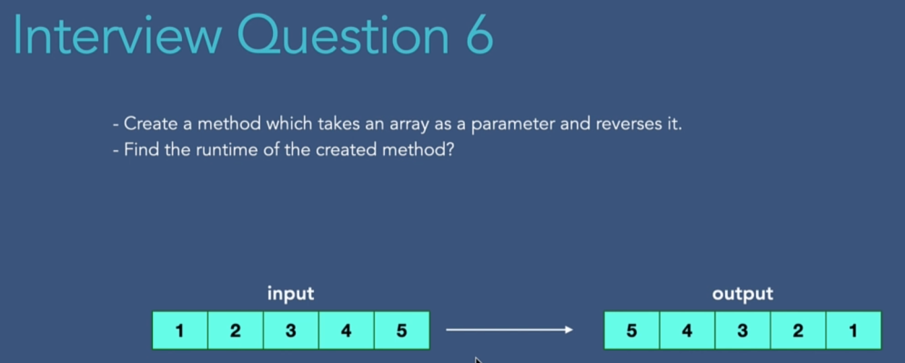
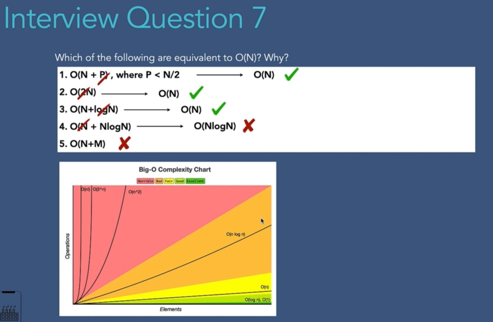
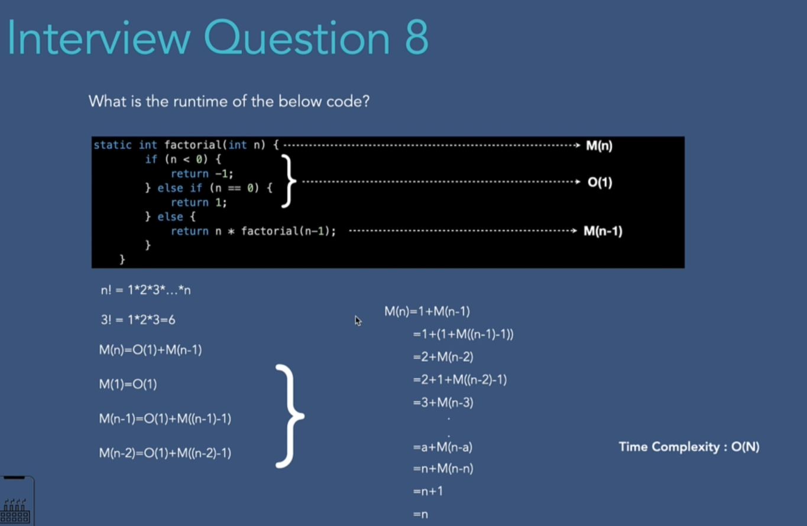

- basic calculus (understanding what a "limit" and asymptote are)
- Series calculations (especially sum of arithmetic progression is often used)
- Basics knowledge of combinatorics ("how many options there are to...?")
- Basics of polynomial arithmetrics (p(x) + q(x) = ?)

# 001 Question 1 - Time Complexity of Method that returns Sum and Product of Array
# 002 Question 2 - Time Complexity of Print Pairs Method

# 003 Question 3 - Time Complexity of Print Unordered Pairs Method

# 004 Question 4 - Find Time Complexity for Given Method

# 005 Question 5 - Find Time Complexity for Given Method

# 006 Question 6 - Time Complexity of Reverse Array Function

# 007 Question 7 - Equivalent to O(N)

# 008 Question 8 - Time Complexity of Factorial
