# 001 What is an Array_

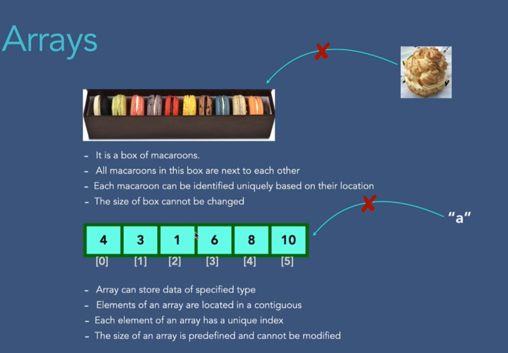
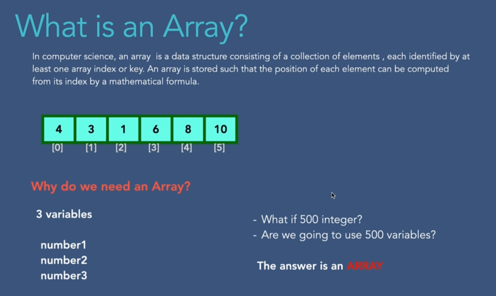

# 002 Types of Arrays
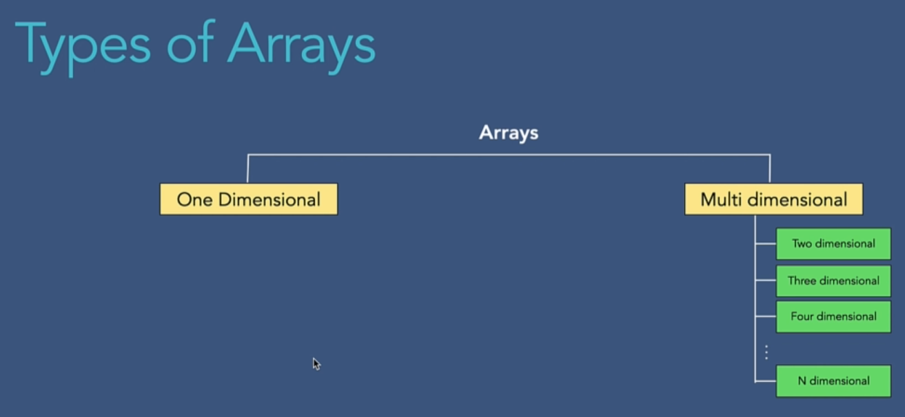
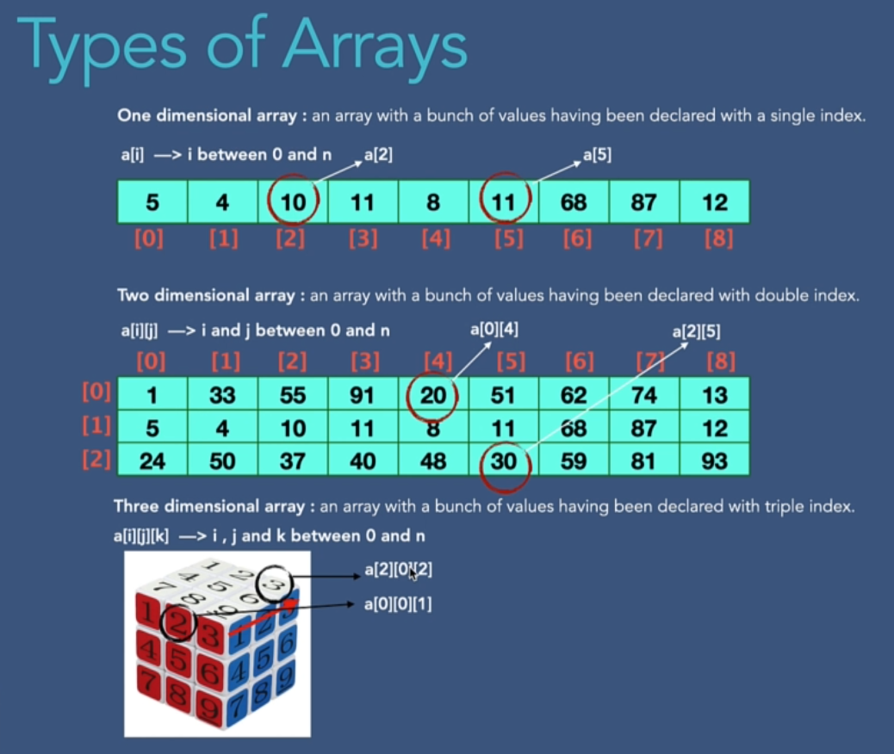
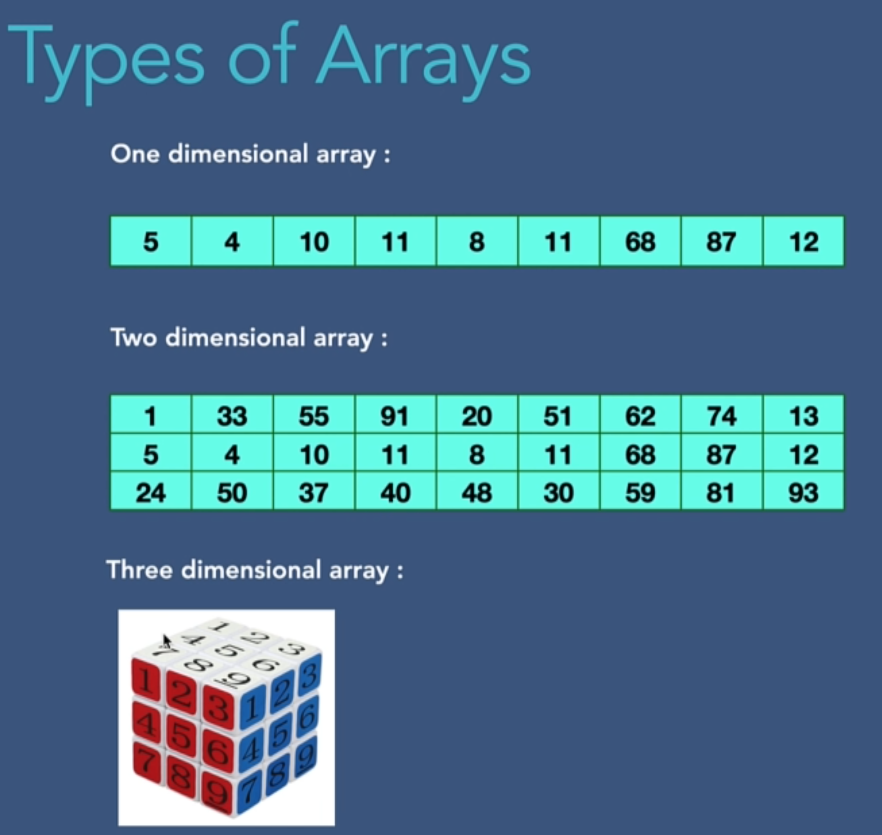

# 003 Arrays in Memory
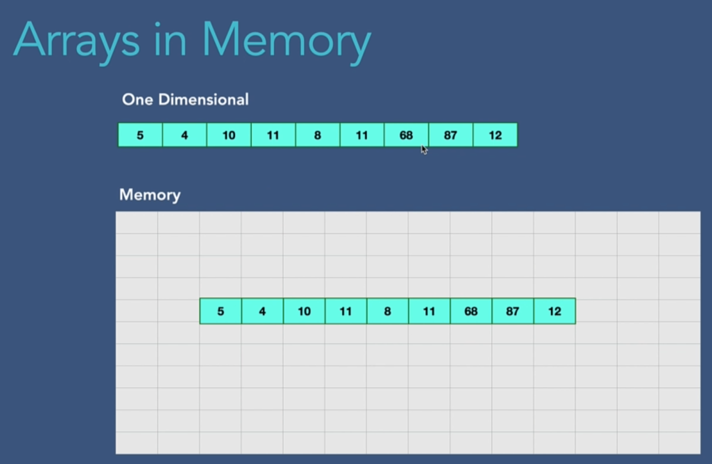
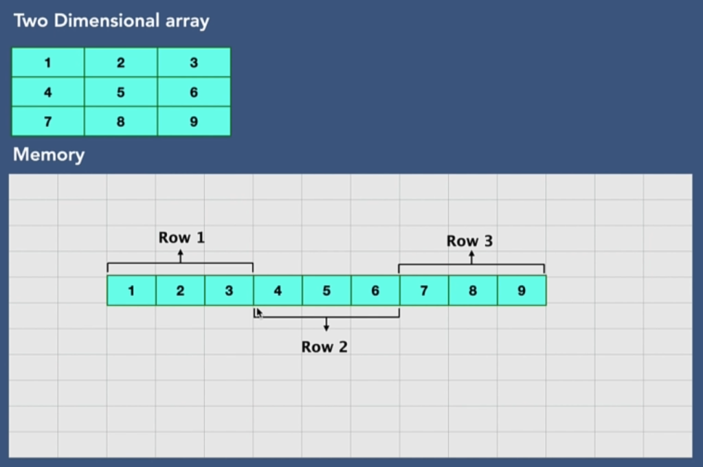
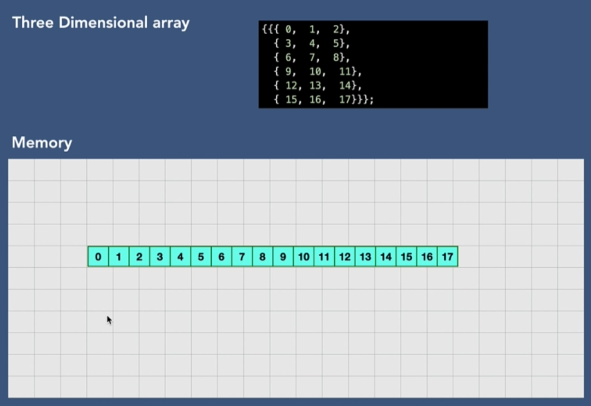

# 004 Create an Array
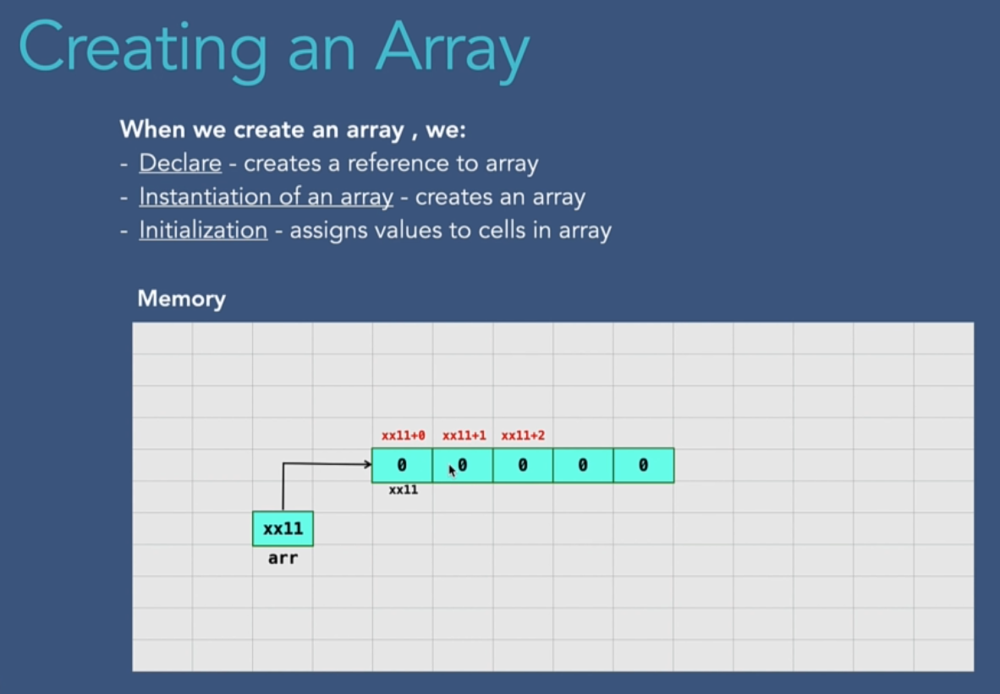

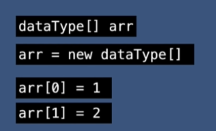

# 005 Insertion in Array
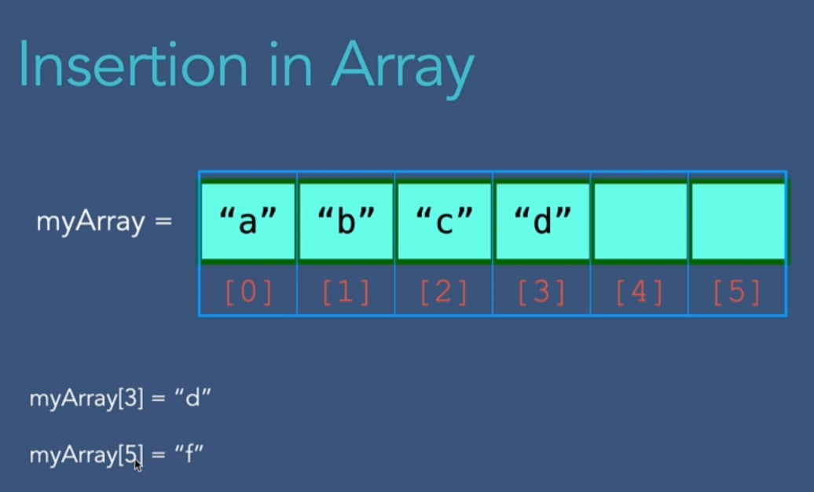
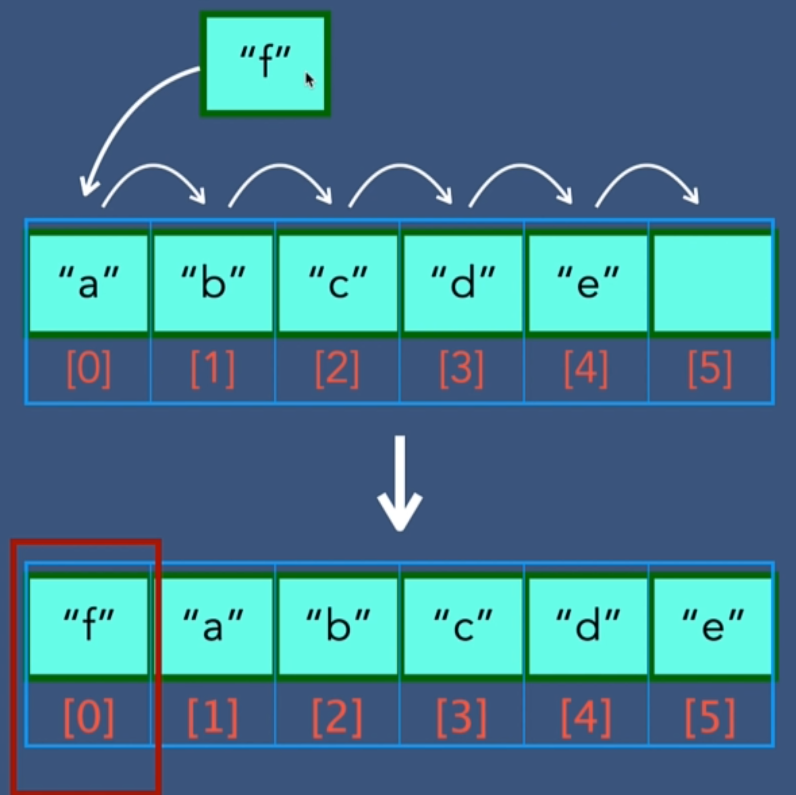
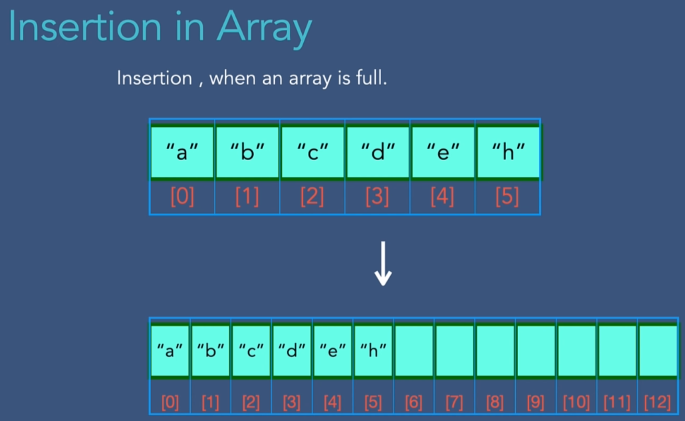

# 006 Accessing Elements in Array

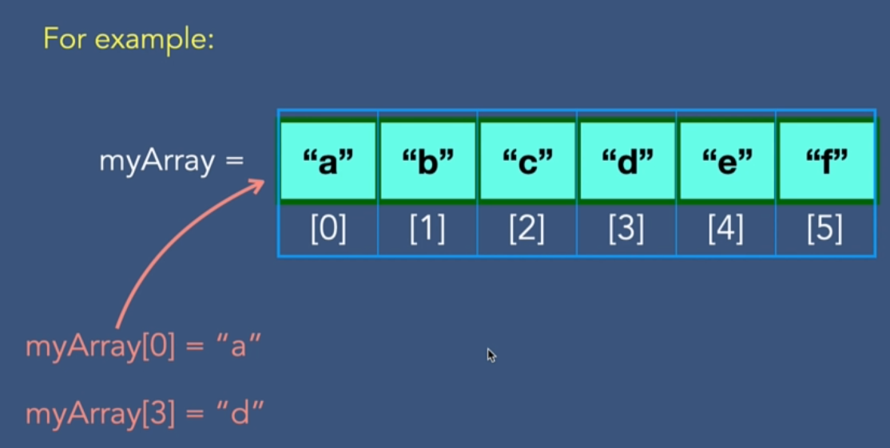

# 007 Array Traversal
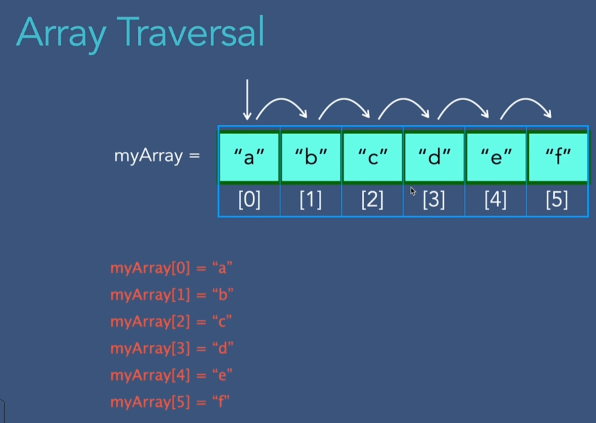

# 008 Search for Array Element
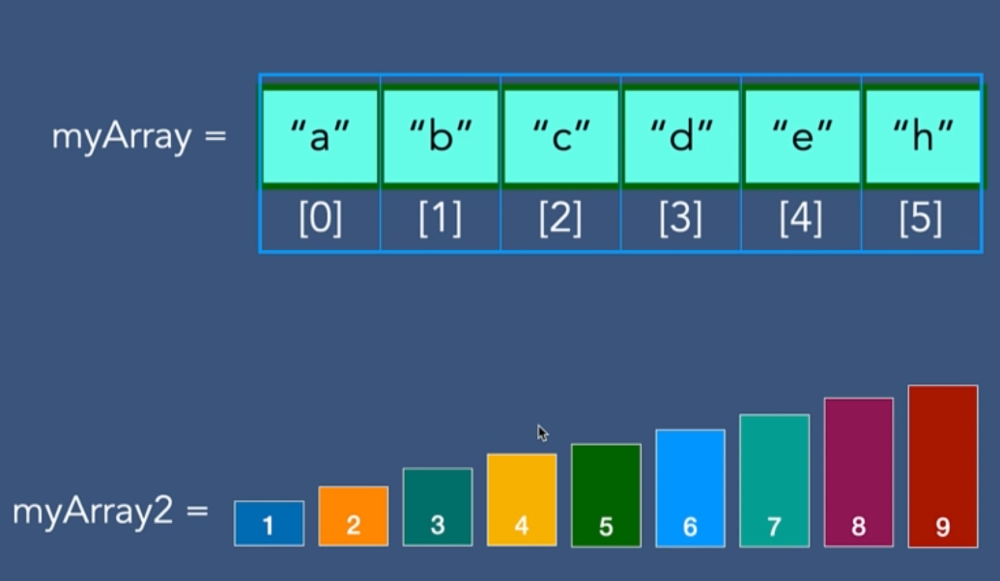

# 009 Delete Array Element
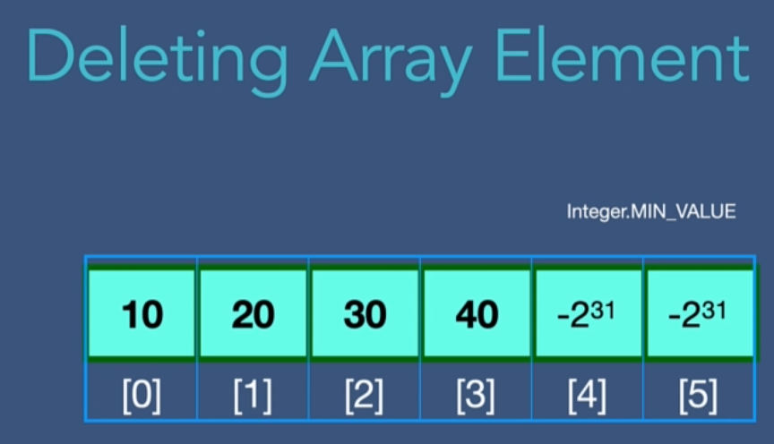
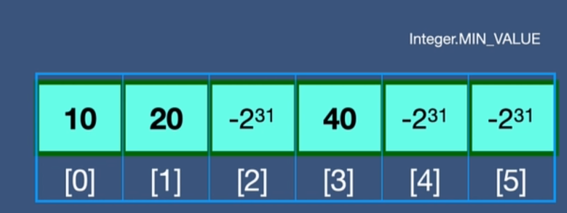