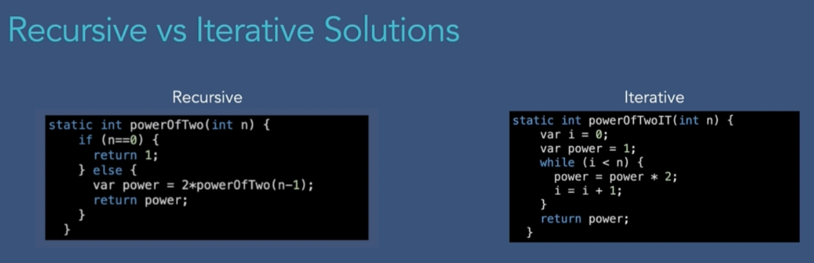
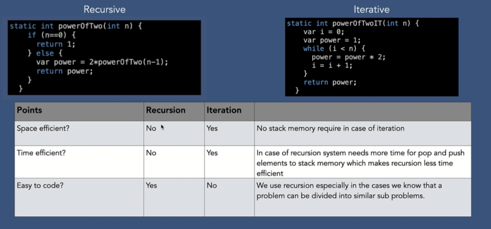
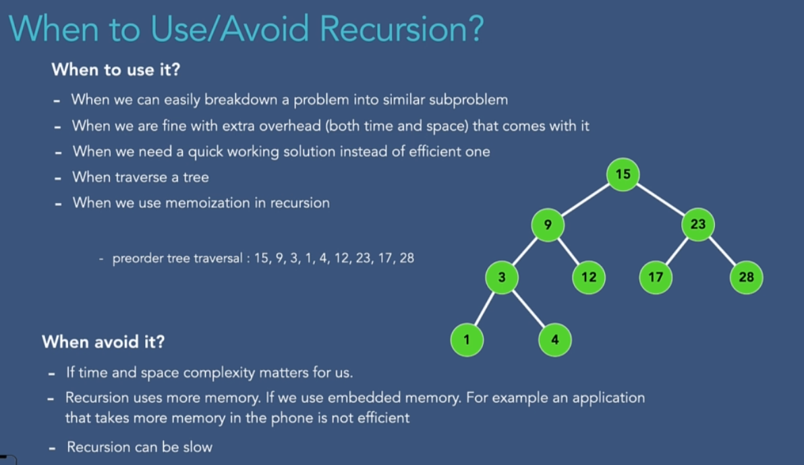
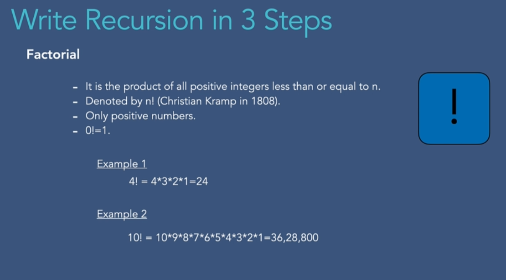
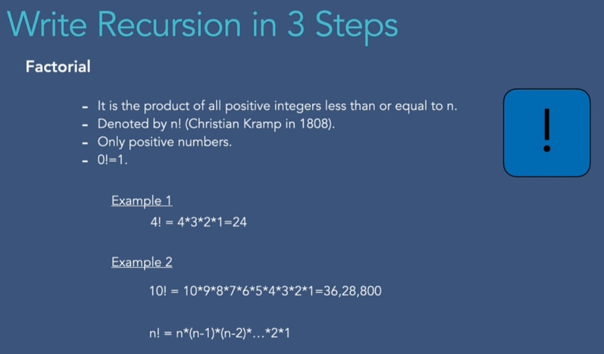
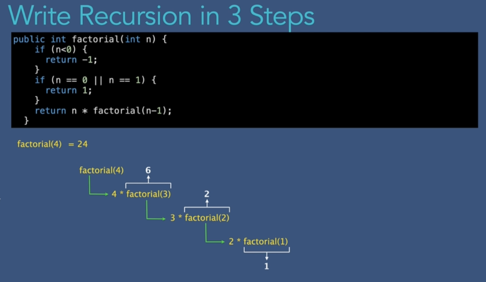

# 001 Goals _ what you will learn by the end of this section

# 002 What is Recursion_

# 003 Why do we need Recursion_

# 004 The Logic Behind Recursion

# 005 Recursive vs Iterative Solution

# 006 When to Use_Avoid Recursion_

# 007 How to Write Recursion in 3 Steps_

