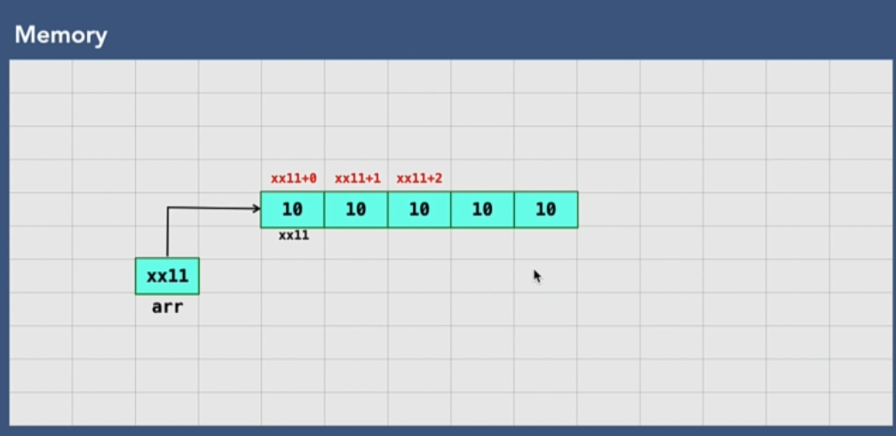

# 001 What is an Array_

# 002 Types of Arrays

# 003 Arrays in Memory

# 004 Create an Array

# 005 Insertion in Array

# 006 Accessing Elements in Array

# 007 Array Traversal

# 008 Search for Array Element

# 009 Delete Array Element

